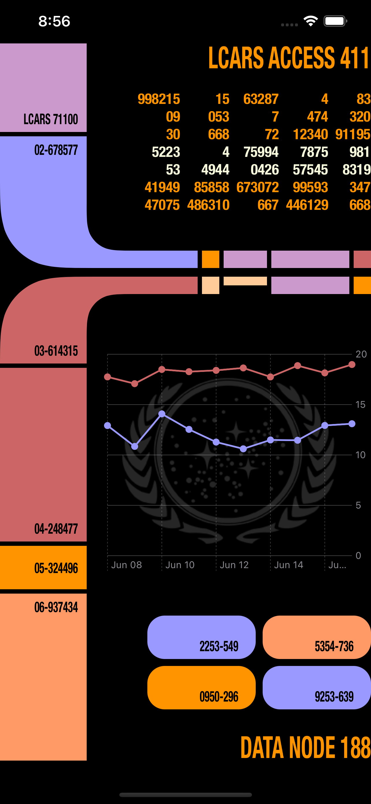
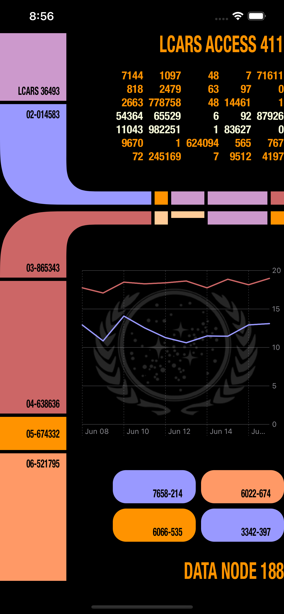
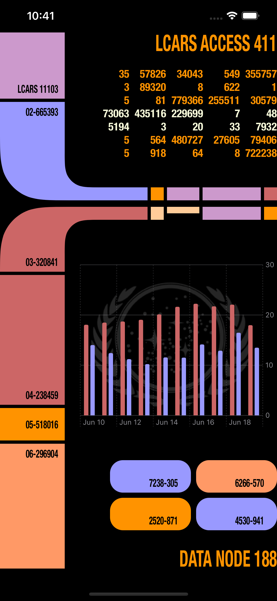
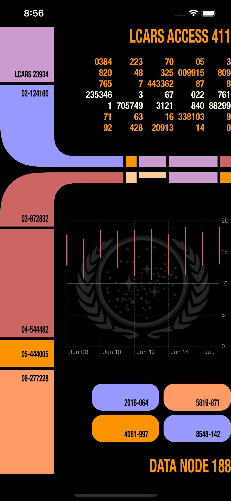
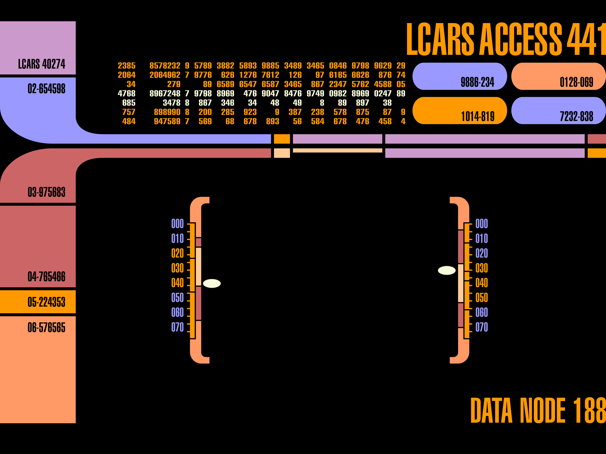

# Challenge: SwiftUI science fiction! 🖖🏻

I went with a Star Trek theme, inspired by the LCARS (Library Computer Access/Retrieval System) design.

Tech used:
- SwiftUI 😍
- WeatherKit for the graph data 🌦
- Swift Charts 📈
- SwiftUI `Grid` for the numbers and buttons layout

### Result

Line chart with Symbols | Line chart
--|--
 | 

Bar chart | Rule chart
--|--
 | 

### Reference image

Source: https://en.wikipedia.org/wiki/LCARS

### Links

Challenge details: https://developer.apple.com/news/?id=f4phvjei

### Workarounds

After adding my bundle id and marking the capability and services to enable WeatherKit, I still receive the `401` error (after many hours).

As a workaround, I have temporarily used the bundle id from the sample sessions to obtain the weather data. `com.example.apple-samplecode.FlightPlanner`

> Please note, this is not production level code
